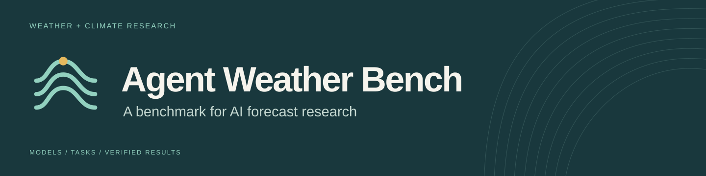
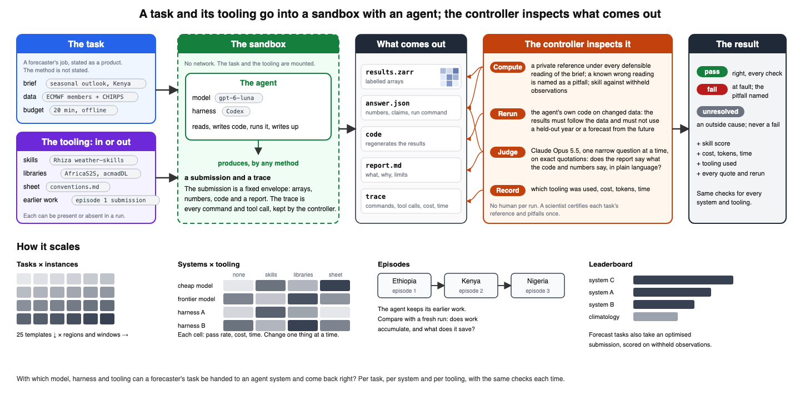

## Which frontier models and agent frameworks can reliably complete substantive weather-forecasting workflows, with what scientific validity, cost, time, and expert intervention?

Agent Weather Bench assesses complete scientific workflows for subseasonal-to-seasonal (S2S) forecasting: acquiring and interpreting data, investigating methods, writing and adapting scientific code, producing forecasts, and verifying results. We compare how models and frameworks perform, and whether supporting resources—skills, scientific libraries, literature retrieval, and prior work—make those workflows more reliable and efficient. Agents submit code, numerical results, and explanations that can be checked against the task requirements.

The benchmark draws on scientific reproduction benchmarks such as [PaperBench](https://openai.com/index/paperbench/) and [SciReplicate-Bench](https://arxiv.org/abs/2504.00255). It uses forecasting research to test whether agents can implement scientific methods, run valid experiments, and support their conclusions with evidence.

For AI and machine learning researchers, the benchmark provides common tasks and scoring to compare agents, the models that power them, and the tools and methods they use. It measures task completion, scientific correctness, cost, and time. Further experiments test whether skills, workflow code, access to literature, or prior work improve performance.

For forecasters, the goal is to provide evidence for choosing agents and supporting methods for specific tasks. Results should show which work a system completes correctly, where it fails, and where expert review is needed.

**Current status:** This repository is for internal development and review. Task data are shared separately. Scientific, scoring, and data redistribution reviews are pending. Seasonal acquisition is disabled, and no repository license has been selected. See [internal setup](docs/internal-setup.md).

[Tasks](#existing-tasks) · [Run a model](#run-a-model) · [Add a substrate](#add-a-method-or-substrate) · [Create a task](#create-and-register-a-task) · [Roadmap](docs/roadmap.md) · [Results](docs/results.md)

## How it works, and where it is going



The question is: under what conditions can a forecaster's task be handed to an agent system and come back right? A task is a canonical forecasting job stated as a product, with frozen data and a budget. It goes into an offline sandbox with an agent and whatever tooling the run supplies: skills, libraries, a conventions sheet, earlier work. What comes out is a fixed envelope, labelled arrays, an answer file, the code that regenerates the results and a report, plus the trace. The controller checks it by computation against a private reference under every defensible reading of the brief, by rerunning the agent's own code on changed data, and by a narrow judge that answers one question at a time on exact quotations. Every check returns pass, fail or unresolved.

Tasks are templates with region and time window as parameters, so one task gives many instances. The set has 25 templates in six families, checked as product, process or outcome; three are built and certified so far. [The roadmap](docs/roadmap.md) states the system, the open work and the eight planned experiments in three pages. [The results so far](docs/results.md) give the first 36 attempts and what the checks caught. [The task set](docs/task-set.md) and [the assessment format](docs/assessment-format.md) hold the detail.

## Forecasting as a research benchmark

S2S forecasting combines established workflows with open research questions. The work includes data preparation, calibration, model combination, downscaling, and verification. Research tasks ask whether a different predictor, dataset, or method improves a forecast.

A result can look plausible while using the wrong data version, region, period, or verification method. The benchmark checks whether the scientific work is valid and whether the submitted code reproduces the reported results.

For forecast tasks, observations provide a separate test of predictive value. Task completion and forecast skill are reported separately. An agent can complete a valid experiment and find that a proposed method gives no improvement.

## What we measure


[Open the diagram at full size](docs/assets/brand/benchmark-design.svg).

| Dimension | Comparison |
| --- | --- |
| Model capability | How reliably does each model complete the same scientific tasks with general tools? |
| Agent frameworks | How do different agent frameworks perform on the same scientific tasks under matched data access and resource budgets? |
| Substrate | How does performance change when we add skills, code, retrieval, or other support? |
| Cost and time | What does a successful solution cost, and how long does it take? Include failed attempts. |
| Reuse | Does agent-owned work from previous tasks improve performance on other benchmark tasks? |

The **substrate** is the support supplied to an agent, such as skills, workflow code, retrieval resources, or prior work.

For model comparisons, keep the agent loop, tasks, inputs, tools, budgets, and scoring fixed.
Record provider and model versions, tokens, costs, and wall time. For substrate
comparisons, also hold the model and agent loop fixed. Report the cost of creating
the substrate separately.

For framework comparisons, hold the model, tasks, data access, resource budgets,
and scoring fixed while allowing orchestration to differ. Record each framework's
version, configuration, and tools so the complete system being assessed is clear.

Reuse experiments compare retained state with reset controls. Counterbalance task
order to separate reuse from task difficulty. Each task is standalone; the experiment
defines the sequence.

## How scoring works

Each task has a hierarchical rubric of weighted scientific outcomes. Assessment
combines artifact checks, numerical tolerances, offline replay, and scientific
judgment. References and held-out targets stay outside the model's workspace.

Completion requires all required outcomes and validity checks to pass. Failed
numerical checks or replay cannot be overridden by the model judge. Missing
evidence leaves the relevant outcome unresolved. Forecast skill is reported
separately from task completion.

The judge, evaluator, task files, and dependencies are locked. Each assessment
retains its evidence, raw judge response, usage, and fingerprint. See the
[locked autojudge](docs/harness.md#the-locked-autojudge).

[Illustrated example: one agent, with and without task tools](docs/assets/brand/agent-task-comparison.svg).

## Existing tasks

Ten registered development tasks cover forecasting, source reconstruction,
verification and bounded optimization. All have local data and executable checks;
scientific review and public data release remain pending. Related tasks retain
their shared forecasting families. The [development audit of 5 October](archive/docs-2026-10/overnight-development.md)
records the solver outcomes and evaluation limitations of this first evaluator.

| Task | Scientific goal | Status |
| --- | --- | --- |
| [Probability forecast combination](tasks/acmad-objective/prompt.md) | Combine probability products. Audit missing support, disagreement, and weighting sensitivity. | Local supplied-input runs. |
| [Predictor definition audit](tasks/wvg-definition-audit/prompt.md) | Recompute two definitions of a climate predictor and explain their differences. | Local supplied-input runs. Full literature review pending. |
| [Seasonal rainfall calibration](tasks/seasonal-calibration/prompt.md) | Acquire data, validate a calibration, and save a prediction workflow. | Verified frozen acquisition replay. Prediction years are development evidence. |
| [Short-rains workflow](tasks/short-rains-workflow/prompt.md) | Repair rainfall units, select predictors with nested validation and calibrate saved forecasts. | Actual inexpensive and frontier attempts. |
| [WeatherBench verification](tasks/weatherbench-verification/prompt.md) | Reproduce valid-time, area-weighted metrics and diagnose comparison faults. | Real forecasts; executable changed-input checks. |
| [Subseasonal optimization](tasks/subseasonal-optimization/prompt.md) | Improve weeks 3–4 precipitation forecasts with bounded development feedback. | Five-query controller tool; private final targets. |
| [Seasonal CCA reproduction](tasks/cca-seasonal-reproduction/prompt.md) | Reconstruct multivariate mode selection and probabilistic saved-state forecasting. | Independent references; leakage and inference probes. |
| [Station verification](tasks/station-verification/prompt.md) | Decode real station observations and compare forecast interpolation fairly. | NOAA observations; QC, support and fault checks. |
| [Monthly cyclic calibration](tasks/monthly-cycle-calibration/prompt.md) | Assess cyclic statistical sharing under nested whole-year validation. | Independent references; year-leakage and saved-fit checks. |
| [Conservative downscaling](tasks/conservative-downscaling/prompt.md) | Diagnose uncertain units and conserve calibrated rainfall on a fine grid. | Independent geometry; conservation and scale-invariance probes. |

Use the [review pages](tasks/index.html) to inspect and critique each task.
The calibration studies of this evaluator, their review pages and the scripts
that build them are under [`archive/docs-2026-10/`](archive/docs-2026-10/README.md).
New tasks are now written as templates; see [the task set](docs/task-set.md).

## Run a model

Use Python 3.12 or later and Docker. From the repository root:

```sh
python3 -m venv .venv
.venv/bin/python -m pip install -r requirements-controller.lock
./bench tasks list
```

Existing workspaces can use their prepared `.venv`. A fresh clone also needs the
frozen inputs and private references under `var/private/tasks/`. Those data are
currently local and excluded from Git.

Use `./bench tasks validate --metadata-only` to inspect packages without data. The [internal setup guide](docs/internal-setup.md) explains data bundle installation and the complete Docker build. Preparation and validation use repository-owned source snapshots and require no sibling checkouts.

Create a system for the model or agent you want to test:

```sh
./bench systems init my-model
```

Edit `systems/my-model/system.yaml`. Choose the model, driver, runtime image,
and budgets. A baseline receives the task, allowed inputs, and general tools.
Set its substrate to:

```yaml
substrate:
  paths: []
  instructions: ''
```

For a command driver, include its adapter files in `paths`, such as `adapter.py`.
These files connect the model to the harness; they are part of the baseline setup.

The **built-in API driver currently supports Claude**. Gemini, GPT, open-weight
models, and other systems can be connected through the command adapter protocol.
They do not yet have built-in provider drivers. The benchmark design supports
these model comparisons; the current integration coverage is narrower.

See the [driver setup and adapter protocol](docs/harness.md) for the exact
configuration. API credentials stay on the controller. Model tool calls execute
in the isolated scientific runtime.

```sh
./bench systems validate my-model
./bench run wvg-definition-audit --system my-model
./bench runs report
```

The scaffold defaults to an existing local Docker image. On another machine,
pass your image's full content ID to `systems init` with `--image sha256:...`.
The integration guide describes runtime requirements.

The default judge needs `ANTHROPIC_API_KEY`. Use `--judge none` to skip judge API
calls; expert criteria remain pending. API solvers incur their configured model
cost. Codex subscription adapters retain token usage with dollar allocation
recorded as unknown; missing usage is also unknown.

## Add a method or substrate

A system can include an agent framework, forecast method, skills, workflow code,
retrieval material, or notes. Create a separate system for each comparison arm.

```sh
./bench systems init my-model-with-skills
```

Put the added material inside its system directory. Declare the paths to include:

```yaml
substrate:
  paths: [adapter.py, skills, workflows, literature]
  instructions: Read /substrate/skills/START.md before beginning the task.
```

Create those paths and the referenced file. The harness snapshots and hashes them,
then mounts them read-only at `/substrate`. Use the same model, loop, runtime,
and budgets as the baseline when testing the added material.
The built-in API driver does not need `adapter.py` in this list.

```sh
./bench run wvg-definition-audit --system my-model-with-skills
```

For reuse experiments, use `--parent RUN_ID` or a
[sequence configuration](experiments/example-sequence.yaml). A fresh conversation
receives agent-owned state and prior artifacts. Private targets and assessments
stay outside that workspace. See [reuse across tasks](docs/harness.md#reuse-across-other-tasks).

## Create and register a task

1. Create a package in `tasks/YOUR_TASK_ID/`. Write its brief, source record,
   outputs, rubric, and review questions.
2. Freeze allowed inputs and private references. Define the data cutoff for
   forecast tasks and exclude later observations from execution.
3. Register preparation, numerical checks, reference calculations, replay outputs,
   and the review summary. Current evaluators require task-specific code.
4. Test a correct solution and credible errors. Have domain reviewers check the
   scientific requirements, scoring, and data rights.
5. Validate the package and record the reviewed assessment lock.

```sh
./bench tasks prepare
./bench tasks validate
./bench tasks render
.venv/bin/python -m pytest -q
./bench judge lock
```

The [task authoring guide](docs/task-authoring.md) gives the package layout,
manifest requirements, and exact registration points.

## Inspect results

Every attempt lives in `var/runs/<run-id>/`. It includes task and system snapshots,
events, usage, frozen outputs, and assessment records.

```sh
./bench runs list
./bench runs show RUN_ID
./bench assess RUN_ID
./bench runs report
```

Open `var/index.html` to inspect the run index. A shared result should identify
the task version, model and system configuration, runtime, judge fingerprint,
completion score, costs, time, and retention condition.

| Location | Contents |
| --- | --- |
| `tasks/` | Briefs, rubrics, manifests, and review pages |
| `templates/` | Task templates in the new assessment format, with specs and certification records |
| `assessment/` | The generic assessment package for templates |
| `standards/` | Practices and draft checklists for process-mode templates |
| `systems/` | Model and agent configurations, adapters, and optional substrates |
| `judges/` | Assessment configuration, prompt, and lock |
| `experiments/` | Comparison designs and task sequences |
| `weatherbench/` | Execution, preparation, and scoring code |
| `docs/` | The roadmap, the results, the task set, the assessment format, the guides to the first evaluator, and brand assets |
| `var/` | Ignored local inputs, references, runs, and reports |
| `archive/` | Preserved pilot code and evidence |

The [README and brand preview](docs/assets/brand/index.html) includes the diagram,
logo, and share images. The [historical pilot](archive/README.md) remains separate
from current benchmark runs.
