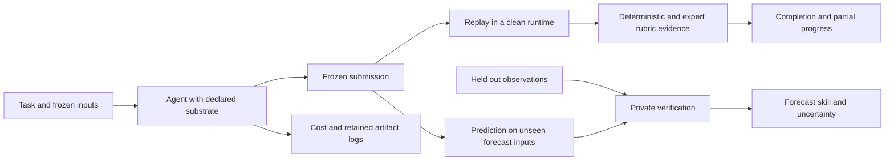

# Agent Weather Bench review and framework design

Discussion draft, 2 October 2026. The proposal is to benchmark complete pieces of
forecasting research and compare the resources that make them reliable, affordable,
and reusable. Start by making the existing seasonal experiment independently
gradable, then develop a small portfolio from all three proposed sources. The
choices below are recommendations, not a frozen experimental protocol.

## Review of the argument

The strongest contribution is the combination of substrate comparison, cost, and
accretion within a scientific workflow that produces testable forecasts. Keep the
opening account of forecasting as a research loop, the definition of substrate,
and the final ambition. They explain why this should become a benchmark rather
than another demonstration of an agent making a map.

Five changes would make the announcement more defensible:

1. **Narrow the novelty claim.** Other scientific and ML benchmarks have test data,
   reference outputs, and execution checks. The distinctive opportunity here is
   a forecast issued before its target observations exist, alongside a reference
   method and a continuing sequence of related research tasks. Forecasting offers
   a useful separation between reproducing a workflow and testing its predictive
   value. It does not uniquely possess external truth.
2. **Qualify source completeness.** A bulletin often omits implementation choices;
   a published consensus outlook can include forecaster adjustments beyond the
   numerical objective. Describe tasks as reconstructing a specified, documented
   component unless expert review establishes the complete operational procedure.
3. **Define substrate operationally.** It is the versioned bundle of knowledge,
   executable tools, interfaces, retrieval resources, and prior artifacts exposed
   to an agent. Record the bundle separately from the model, orchestration,
   runtime, data entitlement, and task. The observed system is their combination.
4. **Keep skill separate from completion.** Correctly disproving a teleconnection
   or showing that a calibration worsens RPS can complete a research task. Better
   held-out skill is an outcome to report. A task asking for an improvement should
   ask the agent to test and report the improvement, with credit for a rigorous
   negative result.
5. **Make accretion a controlled claim.** A cheaper second task can reflect an easier
   problem, cached input, a saved fit, or selective follow-ups after success.
   Include reset controls and measure what was actually retained.

A replacement for the comparison paragraph could read:

> Forecasts resolve. Their target observations arrive after issue, making it
> possible to evaluate both whether an agent reproduced the specified workflow
> and whether its predictions were useful. Scientific reproduction benchmarks
> provide valuable designs for task packaging and evaluation; forecasting adds a
> continuing sequence of dated predictions and subsequent observations. That
> sequence lets us ask whether accumulated tools and knowledge improve the cost
> and reliability of the research that produces each forecast.

Use “we propose” until the new dataset and evaluation have been released. The
current evidence supports a pilot and a research hypothesis. It does not establish
reliable completion rates, a general ranking of substrates, or compounding reuse.

## What to borrow from existing benchmarks

| Benchmark | Established design | Proposed use here |
| --- | --- | --- |
| [PaperBench](https://github.com/openai/frontier-evals/blob/main/project/paperbench/README.md) | Hierarchical rubrics; rollout, fresh reproduction, and grading as distinct stages; a separate evaluation of judges | Expert reviewed rubric leaves and independent replay; validate the grader on known correct and incorrect submissions |
| [CORE-Bench](https://github.com/siegelz/core-bench) | Computational reproduction from code and data, with structured answers to task questions and different difficulty levels | A workflow reproduction track; machine readable result extraction; explicit accounting of what supporting material is supplied |
| [SciReplicate-Bench](https://xyzcs.github.io/scireplicate.github.io/) | Implementing functions or methods from paper descriptions and repository context; execution tests | Small diagnostic tasks for scientific method components that can also appear in full workflows |
| [ML-Dev-Bench](https://github.com/ml-dev-bench/ml-dev-bench) | Applied ML development tasks including data handling, debugging, implementation, and performance work; extensible task and agent interfaces | Include real forecast workflow repair and extension, and keep task evaluation independent of the agent adapter |

These are design inspirations, not equivalent task scopes. In particular,
SciReplicate-Bench is focused on algorithm implementation rather than complete
operational forecast reproduction. Our recommendation is to reuse the evaluation
principles while keeping a small harness suited to the existing repository.

## The evaluation unit

One task is a scientific goal, a declared information boundary, and an executable
submission contract. One instance fixes the region, variable, initialization,
lead windows, training and development periods, data vintage, and method constraints.
A family groups related instances. Sequence order and retention policy belong to
the experiment, independently of task definitions. Optional explicit follow-ups
support focused reuse experiments. Replacing one issue date with another creates another instance,
not automatically another independent scientific challenge.

Keep two tracks distinct:

- **Reproduction:** reconstruct a specified product, component, or analysis.
  Reference agreement is relevant, including tolerances appropriate to its method.
- **Research extension:** change a predictor, region, calibration, or lead. Check
  data processing, experimental validity, and verification calculations against
  references. Permit scientifically sound methods to produce different predictions.

Use component diagnostics to explain failures, but keep complete forecasting work
central. A collection of tiny index calculations alone would not test the thesis.

## Task packages and the runner

The current repository already supplies sandboxing, frozen submissions, offline
replay, numeric checks, cost logs, and a judge that cites evidence. Extend those
pieces incrementally. The current task registry is hard coded to three tasks;
the rubric is five shared criteria rather than a tree; and the completed study
has no fresh-workspace follow-up controls.

Each proposed package should contain:

| Component | Required content |
| --- | --- |
| Agent brief | Scientific goal, permissible choices, inputs, output schema, budget and information boundary |
| Source record | Bulletin or paper, relevant sections, source revision/hash, expert clarifications and documented substitutions |
| Input manifest | Object hashes, units, coordinates, members, valid times, release/vintage metadata, licence and redistribution status |
| Rubric | Stable leaf IDs, criterion, evidence, evaluator, dependency, weight and whether failure prevents completion |
| Private evaluation | Unseen inputs where appropriate, verification observations, independently built reference calculations and tolerances |
| Optional follow-up relationship | A scientific relationship useful for a targeted reuse experiment; not a required successor |
| Release record | Task/rubric/data/runtime versions, review status and exact run configuration |

Record visibility per object. Public success requirements are available to every
arm; private target values and evaluator inputs are controller only. Copies of
source repositories supplied to an agent must remove reference answers and
target-specific products that would defeat the intended task.

The agent cannot access the observations supplied to private verification.
Verification tasks that explicitly analyse an already issued forecast are a
different mode: the forecast is immutable, and observations are permitted inputs.
For chained research, later disclosed observations cannot leak backward into an
earlier frozen forecast, and any later prediction must have its own cutoff.

## Layered scoring

Use a score vector with three interpretations:

1. **Workflow correctness:** valid data, units, windows, spatial support, method,
   validation design, required deliverables, and reproducible execution.
2. **Reference agreement:** equality or tolerances where the task specifies a
   computation; separately report deviations from a published product. A
   reasonable alternative calibration should not fail merely for differing from
   the benchmark author's preferred model.
3. **Predictive value:** RPS and RPSS for ordered categories, CRPS when a predictive
   distribution is supplied, RMSE for a point estimate, and calibration/reliability
   diagnostics where sample size supports them. Define formulas, reference
   climatology, spatial weights, missingness and aggregation in the task contract.

The proposed [seasonal rubric](seasonal-rubric-proposal.yaml) decomposes the pilot
into these evidence requirements. It is a draft schema, not readable by the
current evaluator. Implement it under a new scoring version after review, and
retain original scores when regrading historical submissions.

Each leaf should resolve to pass, fail, or unresolved with evidence. Use deterministic
checks whenever possible. A judge can assess an explanation or review a complex
method, but cannot overturn a failed numeric check. Grader unavailability yields
pending assessment, not an agent failure. At final assessment, missing required
submission evidence cannot count as success. Do not let an unrestricted judge
“concerns” list become an extra unpublished completion criterion.

Compute parent scores as the weighted mean of their children. Define weights
relative to siblings, so multiplying weights along a path gives the effective
leaf weight. Report category scores and gate failures alongside the root score;
a strong figure cannot compensate for leakage or incorrect forecast windows.
Dependencies determine whether downstream evidence is valid, without repeatedly
penalizing the same error through arbitrary extra leaves. Freeze the dependency
rules and completion requirements before comparisons.

Validate graders using an expert labelled set containing correct submissions,
plausible failures, wrong lead dates, unit errors, leakage, broken replay,
fabricated results, and well supported negative findings. Injected faults are
grader diagnostics, not substitutes for tasks sourced from real work. Measure
false acceptance, false rejection and expert disagreement by leaf. Give human
reviewers arm-blinded packets where practical.

Forecast scores need enough independent cases. Use paired comparisons on identical
cases and uncertainty over years or issue blocks, rather than treating correlated
grid cells or overlapping lead windows as independent samples. State the number
of resolved cases and the observation product/vintage. Two verification seasons
are a workflow demonstration, not evidence of reliable probabilistic calibration.

## Information cutoffs and contamination

A cutoff includes publication and release availability, not just a coordinate
label. A finalized observation or reanalysis of a pre-cutoff day can have been
released later. A modern reforecast of a historical season can use a later model
system. Make two honest claims available: retrospective evaluation with pinned
modern vintages, or strict reconstruction of information available at issue.
Do not describe the first as the second.

For the primary controlled track, freeze and audit source documents, retrieval
corpora, packages and inputs. Disable unrestricted internet access; retrieval
serves only the approved snapshot. Check that examples, skills and retained
artifacts contain no target answers, private observations or later scores.
Separate live acquisition into a track with its own availability and outage
accounting. Historical observations may be encoded in model pretraining; access
controls cannot prove their absence. Recent or prospective issues can strengthen
evaluation, with an explicit wait for observations to resolve.

For predictor discovery, standardization, region selection, hyperparameters and
thresholds belong inside training folds. A paper's originally selected predictor
can be reproduced as specified, then tested on an independent period; searching
new boxes on the verification years does not constitute independent validation.

## Comparing substrates and cost

Begin with matched contrasts, rather than running every model on every possible
bundle. Proposed starting contrasts are generic tools; curated skills; a workflow
library with usable documentation; frozen retrieval; and a combined bundle.
Each manifest pins content, versions, interfaces, installed dependencies, prompt
additions and indexing. All arms receive the same task-relevant data entitlement,
compute limits and common scientific runtime. Additional scientific functionality
in a library is part of the treatment and must be reported.

Record whether an agent actually opened a skill, retrieved a document or invoked
a library. Compare assigned configurations as the primary analysis. Report use
as diagnostic evidence; successful uptake is itself something the substrate may
affect. Comparing only agents that used a package would change the question.

Pin model IDs, settings, adapter and tool protocol. Record input/output tokens,
cache hits, provider reasoning usage where exposed, tool CPU/GPU/storage/network
cost, agent wall time, evaluation cost and interrupted attempts. Separately report
substrate construction and maintenance cost, including human review.

Use matched task instances and repeated attempts. A small development sweep can
identify broken configurations; an eventual evaluation might begin with five
attempts per condition, with sample size determined by the precision needed.
Five attempts do not establish a high reliability claim. Split development and
evaluation by scientific family/source and time/region where feasible; a dozen
nearby variants of one paper should not dominate the overall score.

“Cost to reliable completion” needs a reliability target chosen before selection.
Report the cost/completion frontier and uncertainty, then identify affordable
configurations meeting the target with sufficient evidence. Include all failed
attempts and retries. Across a fixed workload, total spend divided by successful
completions is a useful observed efficiency measure; with zero successes it is
undefined. It is not automatically the expected cost of retrying to success.
Report conditional cost among successes only as a secondary measure.

## Accretion experiments

The primary experiment runs a system over multiple standalone benchmark tasks,
allowing it to accumulate a substrate without specifying a successor for each
task. This can reveal broadly useful acquisition code, verification routines,
retrieval indexes, methodological notes and debugging knowledge that transfer
across different tasks. It also allows us to observe when irrelevant accumulated
material makes a later task harder.

Store the task order, retention channels, scoring-feedback visibility, reset
controls and continuation policy in an experiment manifest. Each task specifies
only its own inputs and success requirements. Explicit scientific follow-ups are
a complementary experiment for interpreting transfer between closely related
problems. The portfolio's chains are optional relationships, not dependencies.

Randomize or counterbalance order across replicated sequences, and compare each
task with its own fresh-workspace control. With the first three tasks, all six
permutations are a useful design option, subject to an agreed run budget. Compare
the same task at different positions; raw time versus sequence position confounds
learning with task difficulty. With larger task sets, reserve tasks from new
families to test generalization and use balanced subsets rather than enumerating
every permutation. Three tasks can exercise the protocol but cannot establish a
general learning curve.

Use the same model, task brief, starting substrate version, data entitlement and
step budget in retained and reset conditions. Start a fresh conversation at each
task for the primary comparison and transfer only declared files, giving us an
inspectable account of what the system accumulated. Conversation retention can
be a separate experiment. Log initial substrate and subsequent changes separately.

Compare retained and reset conditions for all assigned sequences, including
earlier failures. Continue under a declared policy and count later failures;
report a secondary analysis conditioned on earlier success if useful.
Do not reveal private scores or observations between prediction steps in the
primary experiment. This includes reference outputs, grader explanations and
answers from other packages: they never enter the retained workspace. Maintain
an experiment-wide observation embargo covering every future prediction task;
if a verification task exposes targets another task predicts, exclude that
pairing or freeze all affected predictions before disclosure. Deleting disclosed
files cannot undo the information transfer. If expert repair or oracle artifacts rescue a sequence, label
that as a separate intervention and include its cost.

Useful retention ablations are code and notes, data/cache, fitted state, and the
complete workspace. Log inventories and hashes, refitting, repairs and dependency
updates. Provide equivalent generic download caches in reset controls when the
question concerns methodological reuse. Also report a deployment comparison that
includes data-cache benefits.

Plot cumulative cost against task position, accompanied by completion and scientific
score at each step. Count unsuccessful steps and the common acquisition/setup
policy. A ratio of costs alone can reward an agent that stops doing the work.
Compare each starting substrate's retained/reset difference on the same tasks and
orders. Report within-task cost and completion effects alongside cumulative plots.
A larger benefit for one substrate is stronger evidence than its second task
simply being cheaper. All work to maintain, summarize or reorganize the evolving
substrate counts toward cost, including actions between task attempts.

Separate three transfer distances: same method on a new issue, changed region or
lead, and a new method requiring related knowledge. A saved fit succeeding on the
next batch establishes operational reuse. Useful transfer to a new problem, with
valid review and repairs, is stronger evidence of accumulated research capability.

## Bootstrapping and release

1. Review the seasonal rubric against `archive/pilot-2026-10-01/smoke/task.yaml`, `archive/pilot-2026-10-01/pilot/checks.py`, replay
   evidence and historical judge disagreements. Zeek and Emmett review weights,
   dependencies, evidence sufficiency and completion gates.
2. Package the existing seasonal case and six-week Kenya product as development
   fixtures. Preserve the distinction between the seasonal smoke's inspected
   years and untouched evaluation cases.
3. Review the [candidate portfolio](task-portfolio.md) with centre collaborators.
   Select one standalone task from each of the three source categories for initial curation;
   keep temperature in the portfolio while its archive and reference are audited.
4. Freeze source records and inputs, independently check each reference, then
   validate the evaluator on correct and incorrect submissions before agent trials.
5. Run a bounded development comparison with reset controls. Freeze the release
   protocol before selecting models and evaluating new held-out cases.
6. Release public task specifications, reviewed rubrics and permitted frozen
   inputs on Hugging Face, together with hashes, licences, split membership and
   a dataset card. Keep hidden evaluation targets outside agent downloads;
   provide an evaluator or hosted submission route and a policy for eventual
   target release and new test rounds. Publish the harness and complete run records
   with any necessary secret/source restrictions resolved.

The announcement should centre on a measured result: completion probability and
cost across chains, with an amortization chart and the paired reset comparison.
Report substrate build/maintenance cost separately so apparent savings are not
presented as free capability. The present pilot supplies useful examples and
failure modes; the controlled release supplies the claim.

## Decisions for the next discussion

The three task sources should all be represented. The more consequential choices
are how much original code a reproduction task supplies, whether v1 demonstrates
operational reuse or more distant research transfer, and whether the first skill
evaluation is retrospective or strictly reconstructed as of issue. Those choices
determine the reference effort, task difficulty, and interpretation of the results.
The twelve candidates give us concrete cases on which to make those decisions.
