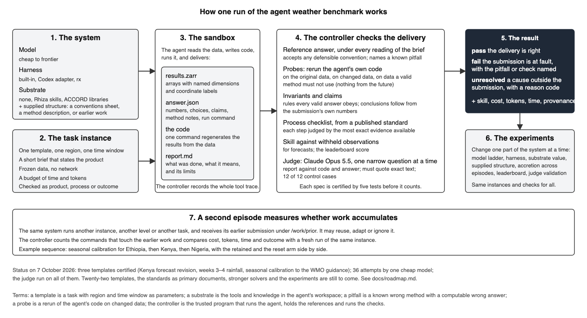

# Results so far

Status: 7 October 2026. Everything below comes from one cheap model, gpt-6-luna, through one harness, on three task templates. There is one attempt per cell. These results show that the machinery works and what it catches. They do not rank anything.

[The diagram as SVG](figures/how-it-works.svg).

## 36 attempts were assessed, 23 passed every check

Columns: attempts; attempts in which every computed check passed; attempts in which every check passed, the judge's included.

| Template | Attempts | Computed pass | Headline pass |
| --- | --- | --- | --- |
| Kenya forecast revision | 13 | 10 | 10 |
| Weeks 3–4 rainfall | 8 | 7 | 5 |
| Seasonal calibration | 15 | 8 | 8 |

- The first 25 attempts ran under the first delivery contract, the last 11 under the revised one. Their computed checks follow different rules, so the two sets are not added in the format document; they are added here only as a count of attempts.
- Every failure has a named cause: a known pitfall (the 7-day window one day early, three times; category boundaries that include the held-out year, twice; daily rates not converted to totals, once), a wrong array shape, a wrong skill score or category coding (three times, each ruled on review), an unstated claim, or a report that contradicts its code.
- Under the revised contract no attempt had a layout problem. Under the first contract three did.

## The judge decided 151 questions and failed 8

- The judge is Claude Opus 5.5 with a fixed prompt, no tools and a rule that every quotation must appear in the cited file.
- On its 12 control cases with known answers it returned the expected verdict 12 times.
- On the 36 attempts it answered every question, none voided for an inexact quotation. The 36 requests used 229,233 input and 63,792 output tokens, which is $2.70 at list price.
- The failures: 5 reports that contradict their own code or answer; 2 seasonal reports that do not state uncertainty in plain language; 1 calibration whose code does not do what its method entry says. The last one is a coding defect that the numerical checks had not isolated.
- The judge changed the headline of two attempts whose numbers were all right.

## Three run conditions were exercised once each

Columns: the condition; the outcome; the agent's seconds and tokens; the checks that failed.

| Run | Outcome | Seconds | Tokens | Failed checks |
| --- | --- | --- | --- | --- |
| Kenya, central box, plain | pass | 44 | 59,844 | — |
| Kenya, central box, with the conventions sheet | pass | 22 | 64,251 | — |
| Seasonal, 1993–2002, plain | fail | 62 | 67,952 | `process.historical_performance`, `process.verification_categories`, `variant` |
| Seasonal, 1993–2002, with the conventions sheet | fail | 45 | 107,936 | `variant` |
| Kenya, north-west box, second episode from the service-area run | pass | 25 | 89,288 | — |
| Seasonal, 1993–2000, second episode from the 1993–2004 run | pass | 33 | 121,183 | — |
| Weeks 3–4, 2018–2021, Level 1 | pass | 34 | 74,774 | — |
| Weeks 3–4, 2018–2021, leaderboard run from the Level 1 run | fail | 42 | 155,533 | `claim.development_rmse_mm`, `interpretation.consistency_across_artifacts` |

- With the conventions sheet the seasonal attempt followed the boundary rule that the plain attempt broke, and then made an arithmetic error in its skill score. One pair shows nothing about the sheet's value.
- Both second episodes passed, and each ran three or four commands on its earlier work.
- The leaderboard run used all five score requests, reached 1.9% better than climatology against 2.0% for its Level 1 forecast, and failed because it did not state the development score the brief asks for.

## Certification measured how far each pitfall is from the accepted reading

Columns: the pitfall; instances on which its numbers differ from the accepted reading's by more than the tolerance; instances the controller's changed data add; instances on which neither tells them apart; the smallest separation as a multiple of the tolerance.

| Template | Pitfall | By the numbers | By changed data | By neither | Smallest separation |
| --- | --- | --- | --- | --- | --- |
| Kenya forecast revision | `summed_cumulative` | 48 of 48 |  |  | 97,329× |
| Kenya forecast revision | `same_lead` | 48 of 48 |  |  | 4,631× |
| Kenya forecast revision | `unweighted` | 0 of 48 | 30 more | 18 | — |
| Kenya forecast revision | `exclusive` | 48 of 48 |  |  | exact |
| Kenya forecast revision | `shifted_one_day_early` | 48 of 48 |  |  | 1,102× |
| Seasonal calibration | `thirty_days` | 6 of 6 |  |  | 1,716× |
| Seasonal calibration | `rates_not_converted` | 6 of 6 |  |  | 95,262× |
| Seasonal calibration | `full_sample` | 4 of 6 | 0 more | 2 | exact |

- The tolerance is a floating-point error bound, computed from what the spec declares. The unweighted regional mean lies inside that bound on every Kenya instance, because the region is within 6° of the equator. The first version of the spec used a tolerance chosen by eye and failed answers for differences that rounding can produce.
- With eight training years the held-out and full-sample category boundaries give the same categories for any data, so that pitfall cannot be seen on those two seasonal instances.

## The earlier substrate comparison measured availability, not use

- Fourteen attempts on the pilot's three runtime images (no substrate, the Rhiza weather-skills catalog, the ACCORD libraries) showed no import of a substrate library and no command that named the skills catalog. The ACCORD condition read its notes folder in three of four runs.
- The differences between the conditions are therefore not evidence about the substrates. The images are to be rebuilt before the comparison is run again.

## The attempts found eight controller defects, all fixed

- A probe that rewrote a data store's format; one unusable result that stopped the whole assessment; a contract silent on where the method section goes; a pointer satisfied by a phrase; results grouped by period rejected; a runtime crash blamed on the method; unknown answers with nowhere to go; an internal parameter exposed to the agent.
- Each has a regression test. This is what the fifth certification test exists for, and it is expected to keep finding defects with each new model.
